# 👋 Hi, I'm hhhhzx

### 热爱前端体验，也喜欢把后端逻辑打磨得可靠一点

  
  
  

---

## 🧭 关于我

- 🔭 目前关注：前端工程化、全栈项目实践、交互体验优化
- 🌱 正在学习：React 生态、Java 后端、接口设计与性能优化
- 💬 可以聊聊：Vue / React / TypeScript / Spring Boot / 项目从 0 到 1
- 🎮 兴趣爱好：游戏、折腾工具、把脑子里的点子做成能跑起来的东西
- ✨ 小目标：写更清晰的代码，做更有温度的产品

## 🛠️ 技术栈

### Frontend

  

### Backend & Database

  

### Tools

  

## ✨ 动态展示

## 📊 GitHub 数据

## 🐍 贡献图

<picture>
  <source media="(prefers-color-scheme: dark)" srcset="https://raw.githubusercontent.com/hhhhzx/hhhhzx/output/github-contribution-grid-snake-dark.svg" />
  <source media="(prefers-color-scheme: light)" srcset="https://raw.githubusercontent.com/hhhhzx/hhhhzx/output/github-contribution-grid-snake.svg" />
  
</picture>

## 🚀 项目方向

| 方向 | 技术关键词 | 我在关注什么 |
| --- | --- | --- |
| 前端应用 | Vue3 / React / TypeScript / Vite | 组件设计、状态管理、页面性能与工程化 |
| 后端服务 | Spring Boot / Java / MySQL / Redis | 接口设计、数据建模、缓存与稳定性 |
| DevOps & Tools | Git / Docker / GitHub Actions | 自动化流程、部署体验、开发效率 |

## 🌟 最近想做得更好的事

- 把项目 README 写得像产品说明书一样清楚
- 多沉淀可复用组件、工具函数和实践笔记
- 用更稳定的方式管理项目结构、接口文档和部署流程

---

### Thanks for visiting!

愿代码保持清醒，愿灵感准时上线。  
如果你也喜欢把想法做成作品，欢迎一起交流。

